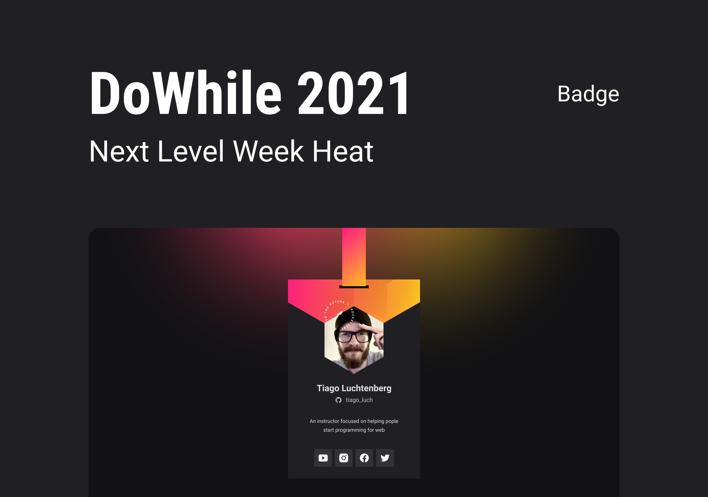
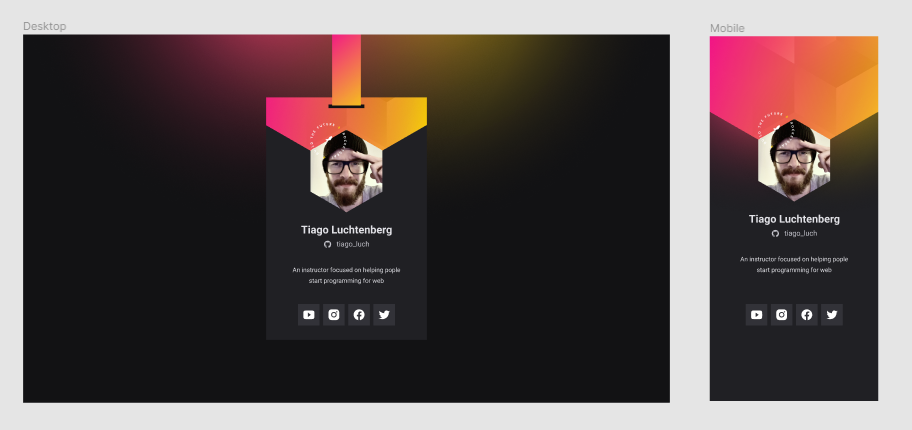

# Crachá NLW

Crachá virtual criado durante a trilha Origin da [NLW/Heat] da [@RocketSeat](https://github.com/Rocketseat "Perfil Github da Rocketseat") para o evento DoWhile 2021.

## Implementação

Você pode ver como ficou a implementação final neste [link](https://dam450.github.io/cracha-nlw/ "Crachá NLW").

## O que foi utilizado?

Foi utilizado no projeto:
-  HTML5
-  CSS3  
-  JavaScript  
-  [GitHub REST API](https://docs.github.com/pt/rest "Documentação da API Github")  
- [Vanilla-tilt.js](https://micku7zu.github.io/vanilla-tilt.js/index.html "Biblioteca JS Vanilla-tilt.js")

## Design

O modelo encontra-se no 
 [Figma](https://www.figma.com/community/file/1031698737363668691/%5BNLW-Heat---Mission%3A-Origin%5D-DoWhile2021 "Projeto do modelo no Figma").

## Licença

Esse projeto está sob a licença MIT. Consulte o arquivo [LICENSE](./LICENSE.md) para mais detalhes.
